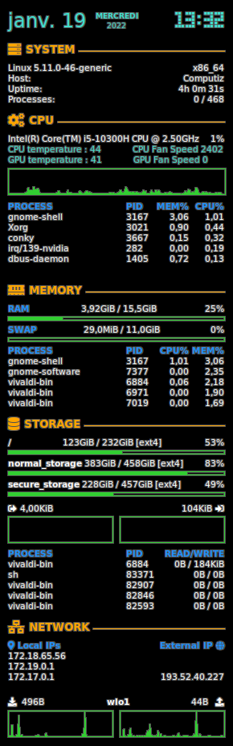

# Installation
```
sudo apt install conky
git clone git@github.com:sudo-Tiz/my_conky.git
mv my_conky ~/.config/conky
```
# Test it : 
`bash ~/.config/conky/launchConky.sh` \
**OR** \
`nohup bash ~/.config/conky/launchConky.sh </dev/null >/dev/null 2>&1 &`

# Startup
either use Launchconky.sh, conky is always present \
either use onBatteryChange.sh conky is killed on battery mode and relaunched on ac mode


